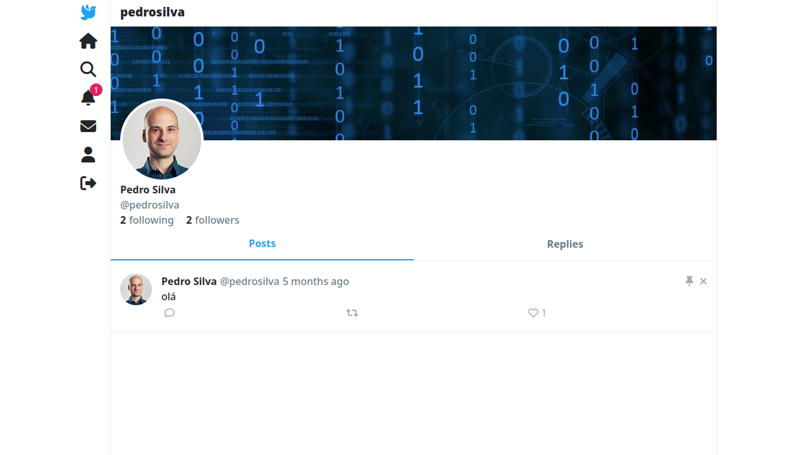
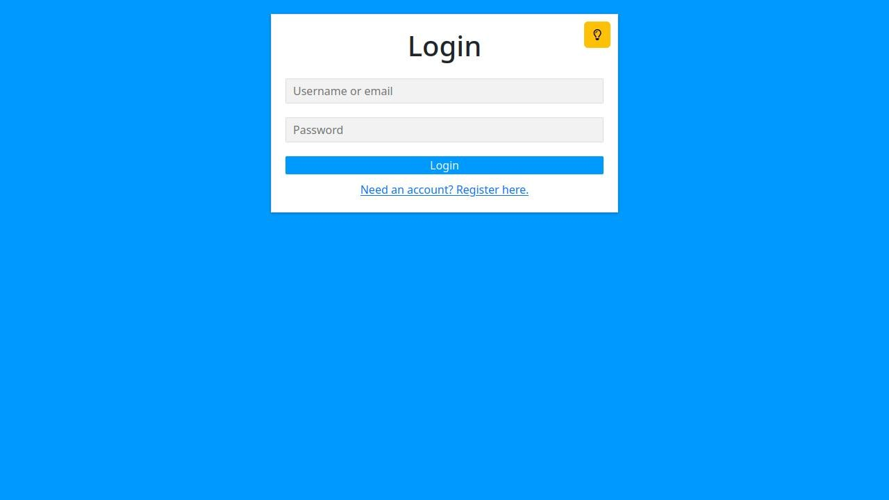
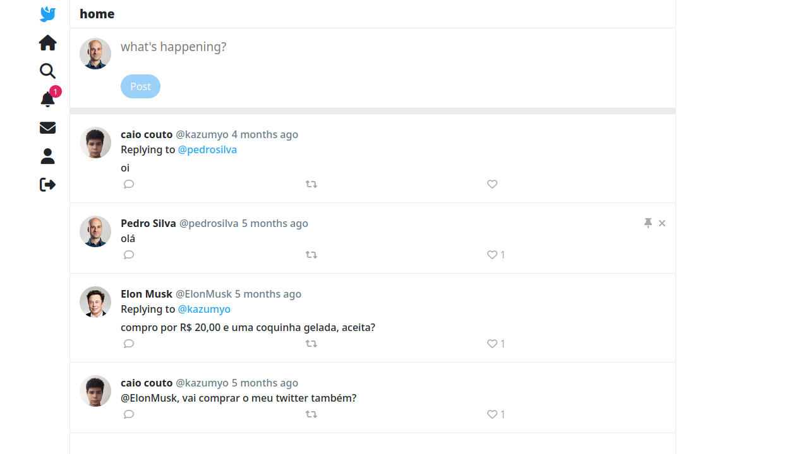
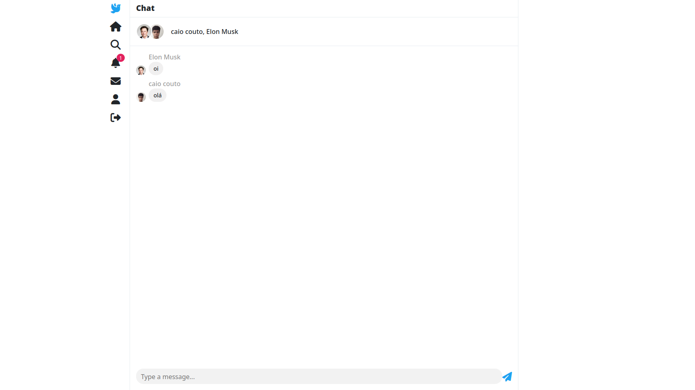
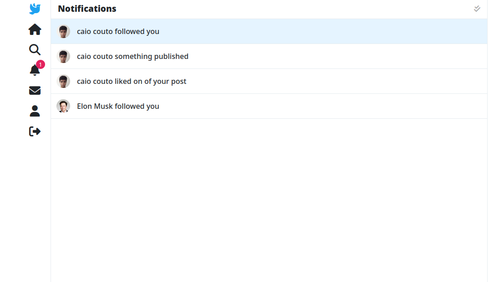
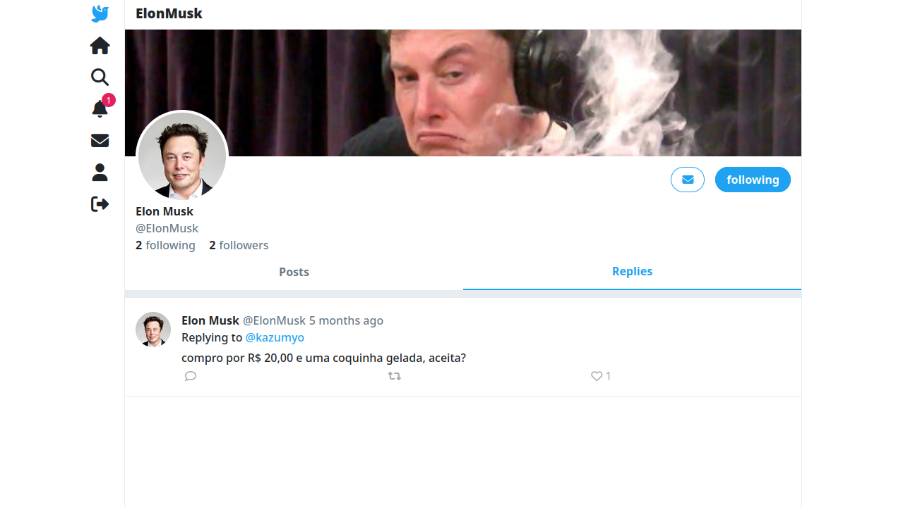

# Twitter-Clone

> O twitter-clone é um projeto inspirado no twitter e em suas principais funcionalidades.
  


## 🚩 Índice

- [O Que é Twitter-Clone?](#o-que-e-twitter-clone)
- [Características](#caracteristicas)
- [Como Usar](#como-usar)
  

## 🤖 O Que é Twitter-Clone?


O Twitter-Clone é um projeto pessoal que desenvolvi para aprender e praticar desenvolvimento web. O projeto é um clone do Twitter, com as principais funcionalidades da plataforma.
Este projeto me deu muita satisfação. Foi uma ótima oportunidade para aprender e praticar desenvolvimento web. Estou satisfeito com o resultado.
Acredito que o Twitter-Clone tem potencial para ser um projeto interessante e útil. Pretendo continuar a desenvolvê-lo e adicionar novos recursos.

 ## 🎨 Características

### Login e Criação de Conta



O login e a criação de conta são as primeiras etapas para que os usuários possam usar seu Twitter-clone. O login deve ser simples e fácil de usar, permitindo que os usuários entrem em sua conta usando seu nome de usuário e senha. A criação de conta deve ser rápida e fácil, permitindo que os usuários criem uma conta fornecendo informações básicas, como nome, e-mail e senha.

  

*  **Opções de login** :  	O login pode ser feito com um nome de usuário único ou com um e-mail.

*  **Senhas criptografadas** :  A senha do usuário é criptografada no back-end e salva no banco de dados.


### Postagens

  


O sistema de posts é o coração do seu Twitter-clone. Os usuários devem ser capazes de criar posts, que são mensagens curtas que são compartilhadas com outros usuários. Inicialmente, os posts podem incluir texto mas pretendo expandir para outros tipos de dados como:  imagens, vídeos e links. Os usuários também devem ser capazes de visualizar os posts de outros usuários, bem como interagir com eles curtindo, comentando e retweetando.
  
*  **Like, Replicar e Comentar** : Assim como no Twitter, os usários podem dar like, replicar e comentar nos posts de seus amigos.

*  **Fixar mensagens** : O usuário pode fixar suas postagens.
  
### Conversas




O sistema de mensagens em tempo real permite que os usuários conversem uns com os outros em tempo real. Isso pode ser feito enviando mensagens privadas ou participando de conversas em grupo. O sistema de mensagens deve ser rápido e confiável, permitindo que os usuários se comuniquem sem problemas.
    
### Notificações

  



 As notificações em tempo real permitem que os usuários sejam notificados sobre atividades recentes, como novos posts, curtidas ou comentários. As notificações devem ser enviadas de forma rápida e discreta, para que os usuários não sejam incomodados.

### Perfil do Usuário



Os perfis de usuário permitem que os usuários compartilhem informações sobre si mesmos com outros usuários. As informações do perfil podem incluir nome, biografia, foto de perfil, interesses e outras informações relevantes. Os usuários também devem ser capazes de personalizar seus perfis.


*  **Seguindo e Seguidores** :  O projeto implementa o sistema de seguindo e seguidores semelhante ao Twitter. O usuário pode encontar e segui seus amigos, dessa forma, podendo visualizar suas postagens e criando grupos de conversas.

*  **Personalizar** : O usuário pode personalizar a foto de perfil e o banner.

### Outros

* **Pesquisa**: O usuário pode fazer pesquisas por posts e outros usuários.

* **Visualizar notificações**: O usuário pode visualizar notificações pendentes com um único clique.

## 🔧 Como Usar
  
Para executar o projeto localmete basta seguir os passos a baixo.

### Setup

Clone-o no sua máquina local. Instale módulos do npm. Antes de iniciar o desenvolvimento, você deve verificar se há algum erro.

```sh
$ git  clone  https://github.com/caio-couto/twitter-clone.git

$ cd twitter-clone

$ npm  install
```

 A após instalar todas as dependencias é necessário popular o arquivo root/.env.example.
 Localize-o e insira uma String de conexão cm o banco de dados MongoDB e uma porta onde o servidor ficará escutando. Após isso insira o comando de execução:

 
```sh
$ npm run start
```
> Abra seu navegador e acesse o localhost na porta definida no .env.
## 📜 License

This software is licensed under the [MIT](https://github.com/nhn/tui.editor/blob/master/LICENSE) ©.
